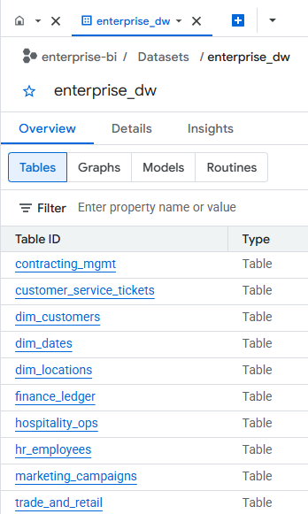

# 🧭 Phase 2: Data Profiling & Analytical Readiness

Phase 2 focuses on understanding and validating the data available in the data warehouse before transforming it for analysis. Using **BigQuery and SQL**, the data is profiled to identify data-quality issues, validate relationships, understand table grain, and assess analytical readiness.

## Objectives

- Understand the structure and grain of the warehouse tables.
- Profile data completeness, uniqueness, validity, and consistency.
- Identify data-quality issues and anomalies.
- Validate fact-to-dimension relationships.
- Assess whether the data can support the analytical requirements defined in Phase 1.
- Translate profiling results into technical decisions for the next phase.

## Data Warehouse

The warehouse currently contains:

- **Shared Dimensions**
  - `dim_dates`
  - `dim_locations`
  - `dim_customers`

- **Domain Facts**
  - `trade_and_retail`
  - `finance_ledger`
  - `hr_employees`
  - `hospitality_ops`
  - `contracting_mgmt`
  - `marketing_campaigns`
  - `customer_service_tickets`

The warehouse is profiled broadly, while the **Sales & Retail domain** will be the primary focus of the downstream technical implementation.



## Workflow

### 1. Schema & Data Inventory

Inspect tables, columns, data types, row counts, candidate keys, and NULL values using BigQuery metadata and SQL.</br> **[[View Implementation Process](documentation/01_schema_data_inventory.md)]**

### 2. Data Profiling

Analyze table volumes, duplicates, distinct values, distributions, numeric ranges, date coverage, and overall data-quality characteristics.</br> **[[View Implementation Process](documentation/02_data_profiling.md)]**

### 3. Relationship Validation

Validate fact-to-dimension relationships, foreign keys, orphan records, cardinality, and fact-table grain.</br> **[[View Implementation Process](documentation/03_relationship_validation.md)]**

### 4. Analytical Readiness

Consolidate the findings from Steps 1–3 and assess whether the available data can support the business questions and KPIs established in Phase 1.</br> **[[View Implementation Process](documentation/04_analytical_readiness.md)]**

## Conclusion

The profiling and validation activities confirmed that the warehouse is structured, complete, and suitable for the defined analytical requirements.

No significant data-quality or relationship issues were identified that would prevent downstream analysis. The validated fact-table grain, dimensional relationships, available measures, and date coverage provide a reliable foundation for the planned Sales & Retail analytical implementation.

The KPI assessment confirmed that the core sales, customer, location, and time-based KPIs can be supported by the existing warehouse. It also identified limitations for **Gross Profit** and **Gross Margin %**, as the current warehouse does not contain the required COGS data.

Based on these findings, no additional warehouse structures are required at this stage. The project can proceed to the next phase with the Sales & Retail domain as the primary technical implementation focus.

## Phase 2 Repo Structure
```text

├── phase_2_data_profiling/
│       ├── sql/
│       │       ├── 01-Schema-Assessment_null_check.sql
│       │       ├── 01-Schema-Assessment.sql
│       │       ├── 02-Data-Profiling_categorical_profiling.sql
│       │       ├── 02-Data-Profiling_date_profiling.sql
│       │       ├── 02-Data-Profiling_null-check.sql
│       │       ├── 02-Data-Profiling_numeric-profiling.sql
│       │       ├── 02-Data-Profiling_tables_volume.sql
│       │       ├── 02-Data-Profiling_unique_keys.sql
│       │       ├── 03-Relationship-Validation_cardinality.sql
│       │       └── 03-Relationship-Validation_foreign_key_integrity.sql
|       |
│       ├── documentation/
│       |       ├── 01_schema_data_inventory.md
│       |       ├── 02_data_profiling.md
│       |       ├── 03_relationship_validation.md
│       |       └── 04_analytical_readiness.md
|       |
│       └── snapshots/
|               ├── ...
```