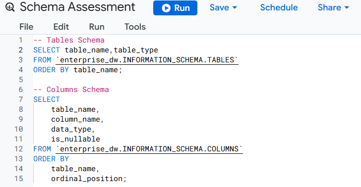
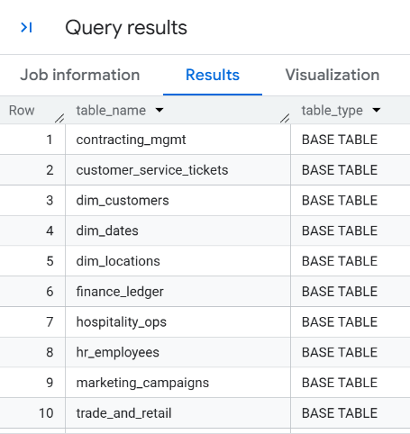
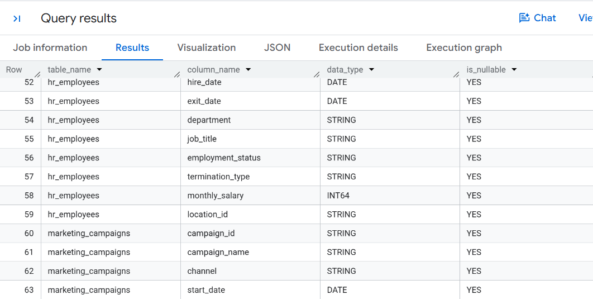

# 🧭 Phase 2: Data Profiling & Analytical Readiness
## 🔷 Step 1: Schema & Data Inventory

Establish the structure of the existing BigQuery data warehouse before performing detailed data profiling and quality checks.

The inventory covers the available tables, their roles, schema characteristics, and initial completeness assessment.

## Warehouse Inventory

The warehouse currently contains **10 tables** across shared dimensions and business-domain fact tables.

| Table                      | Type             | Domain                   |
| -------------------------- | ---------------- | ------------------------ |
| `dim_dates`                | Shared Dimension | Common                   |
| `dim_locations`            | Shared Dimension | Common                   |
| `dim_customers`            | Shared Dimension | Common                   |
| `trade_and_retail`         | Fact Table     | Sales & Retail           |
| `finance_ledger`           | Fact Table     | Finance                  |
| `hr_employees`             | Fact Table      | Human Resources          |
| `hospitality_ops`          | Fact Table     | Hospitality / Operations |
| `contracting_mgmt`         | Fact Table      | Contracting / Projects   |
| `marketing_campaigns`      | Fact Table      | Marketing                |
| `customer_service_tickets` | Fact Table      | Customer Service         |

## Schema Assessment

The warehouse schema was inspected using BigQuery `INFORMATION_SCHEMA` metadata.

The assessment covered:

* Table names and types
* Column names
* Data types
* Column nullability
* Table structure

**All columns are currently defined as **nullable** in the BigQuery schema.**   

> ### SQL Files: [`01-Schema-Assessment.sql`](../sql/01-Schema-Assessment.sql),  [`01-Schema-Assessment_null-check.sql`](../sql/01-Schema-Assessment_null-check.sql)
 

  
  

However, schema-level nullability does not necessarily indicate that NULL values exist in the data. Therefore, an additional profiling query was executed across all 10 tables to assess actual NULL occurrences.

## Technical Approach

The inventory and initial completeness assessment were performed using:

* **Google BigQuery**
* **SQL**
* BigQuery `INFORMATION_SCHEMA`
* Dynamic SQL for automated column-level NULL profiling

## Step 1 Conclusion

The warehouse structure has been established and the initial completeness check has been completed.

The data currently contains **no observed NULL values**, providing a clean baseline for the next profiling activities.

### Next: [[Step 2: Data Profiling](02_data_profiling.md)]

