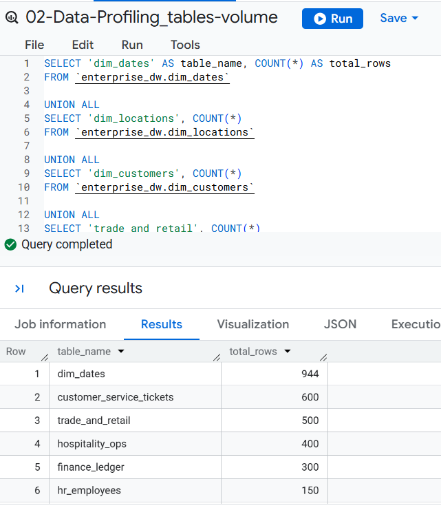
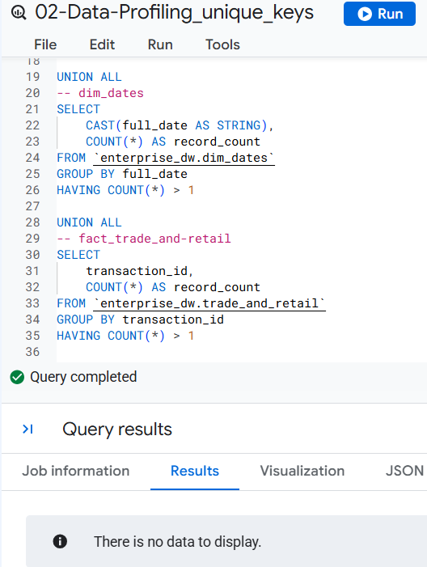
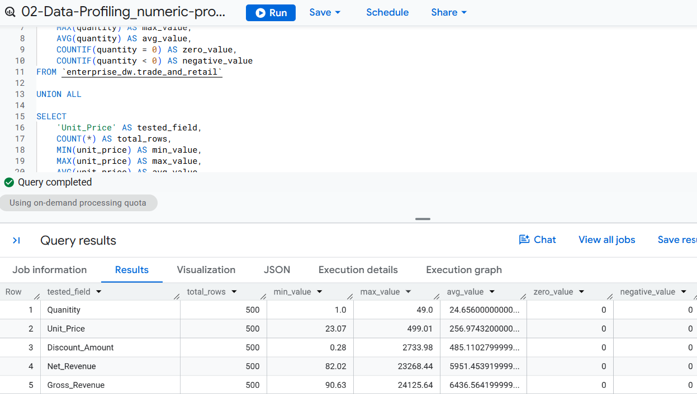
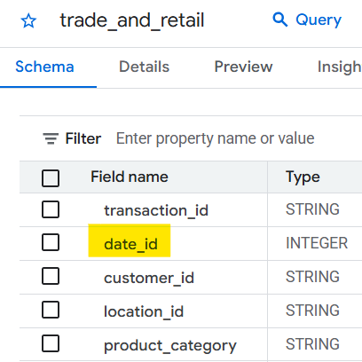
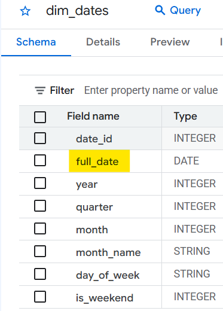
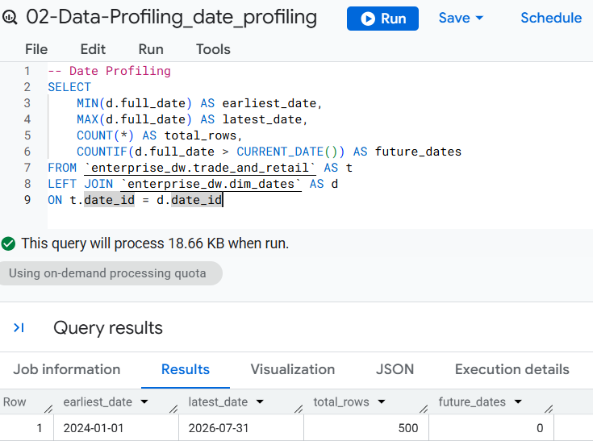
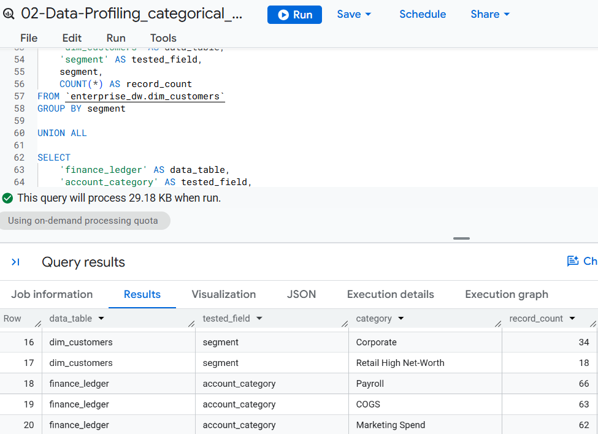

# Step 2: Table-Level Data Profiling

Profile the actual contents of the warehouse tables to understand their volume, uniqueness, distributions, and key data characteristics before performing formal data-quality assessment.

All profiling is performed using **BigQuery SQL** against the existing warehouse tables.

## Profiling Areas

### 1. Table Volume

Measure the number of records in each warehouse table to establish the size and relative scale of the data. 
> **SQL File: [`02-Data-Profiling_tables-volume.sql`](../sql/02-Data-Profiling_tables-volume.sql)**
 

### 2. Key Uniqueness & Duplicates

Evaluate candidate business keys and identify duplicate records while considering the expected grain of each table. 
> **SQL File: [`02-Data-Profiling_unique_keys.sql`](../sql/02-Data-Profiling_unique_keys.sql)** 
 

### 3. Numeric Profiling

Profile relevant measures using:

* Minimum
* Maximum
* Average
* Zero values
* Negative values

***To Avoid repetitive work, this will be only applied to the `trade_and_retail` table.***
> **SQL File: [`02-Data-Profiling_numeric_profiling.sql`](../sql/02-Data-Profiling_numeric_profiling.sql)** 
 

### 4. Date Profiling

Assess relevant date fields for:

* Earliest and latest dates
* Date coverage
* Future dates

**The trade_and_retail fact table does not store the calendar date directly. Instead, it contains a date_id that references dim_dates. Therefore, date coverage was profiled by joining `trade_and_retail` to `dim_dates`.**
> **SQL File: [`02-Data-Profiling_date_profiling.sql`](../sql/02-Data-Profiling_numeric_profiling.sql)**

 

 
 
 
 

### 5. Categorical Profiling

Review important categorical fields to identify:

* Distinct values
* Value frequencies
* Blank values
* Potentially unexpected categories

> **SQL File: [`02-Data-Profiling_categorical_profiling.sql`](../sql/02-Data-Profiling_categorical_profiling.sql)**

 

## Findings
Table-level profiling showed that the warehouse data is structurally clean and consistent across the reviewed dimensions and fact tables.

**The profiling provided evidence across the main data-quality dimensions:**
- **Completeness:** No NULL values were identified across the warehouse.
- **Uniqueness:** No significant duplicate or key-uniqueness issues were identified.
- **Validity:** Numeric values, ranges, and dates showed no significant anomalies requiring immediate action.
- **Consistency:** Categorical distributions showed no significant inconsistencies in the reviewed fields.

Overall, no immediate data-quality issues were identified that would prevent analysis.
