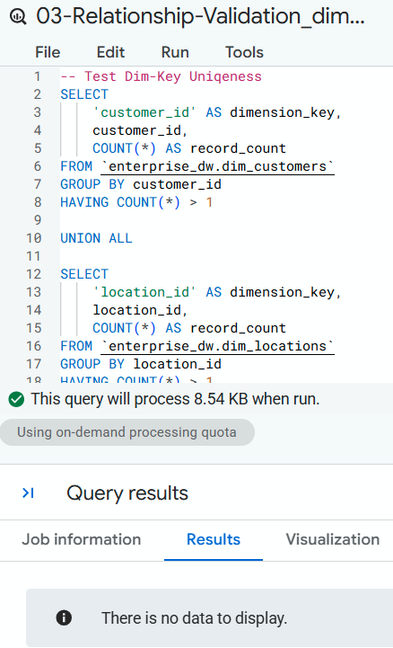
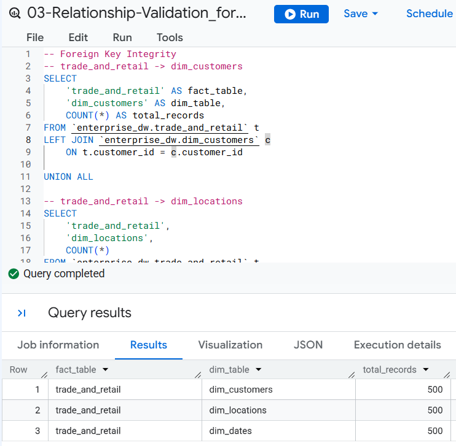
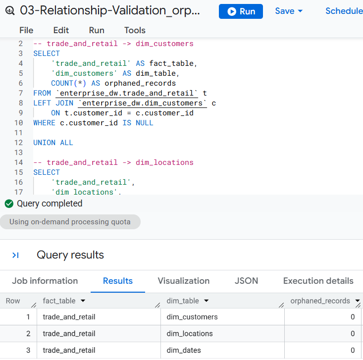
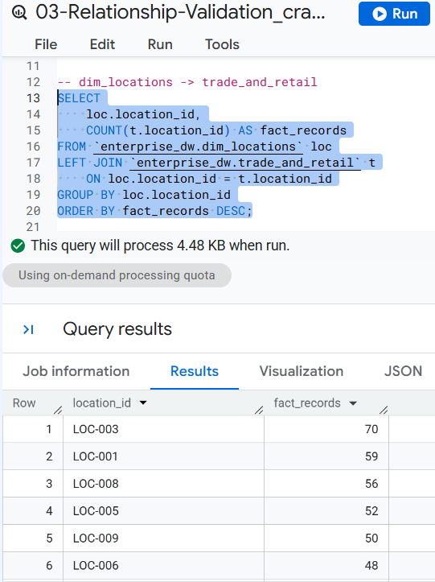

# Step 3: Relationship Validation
Validate that the relationships between the fact table (`trade_and_retail`) and shared dimensions.

## Validation Areas

### 1. Dimension Key Uniqueness
Confirm that dimension keys uniquely identify records.

> ### SQL File: [`03-Relationship-Validation_dim_key_unique.sql`](../sql/03-Relationship-Validation_dim_key_unique.sql)

 

### 2. Foreign-Key Integrity
Check that fact-table foreign keys have matching records in the related dimensions.

> ### SQL File: [`03-Relationship-Validation_foreign_key_integrity.sql`](../sql/03-Relationship-Validation_foreign_key_integrity.sql)

 

### 3. Orphan Records
Identify fact records whose foreign keys do not have a corresponding dimension record.  
> ### SQL File: [`03-Relationship-Validation_orphan_records.sql`](../sql/03-Relationship-Validation_orphan_records.sql)

 

### 4. Relationship Cardinality

Validate the expected **one-to-many** relationship between dimensions and fact tables.
> ### SQL File: [`03-Relationship-Validation_cardinality.sql`](../sql/03-Relationship-Validation_cardinality.sql)

 

## Findings
Relationship validation confirmed that the warehouse relationships are structurally sound and consistent with the expected dimensional model. Dimension keys are unique, fact-table foreign keys correctly reference their dimensions, and no significant orphan records or relationship anomalies were identified.

Overall, the current data model provides a reliable foundation for analysis and reporting.

### Next: [[Step 4: Analytical Readiness](04_analytical_readiness)]
