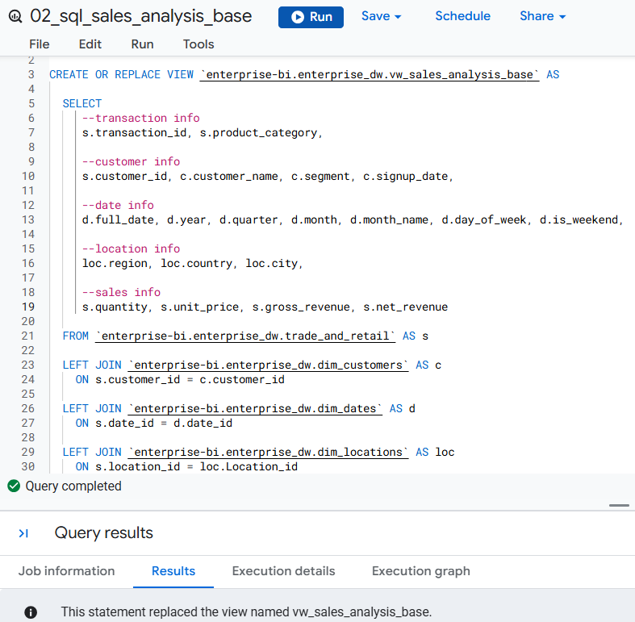
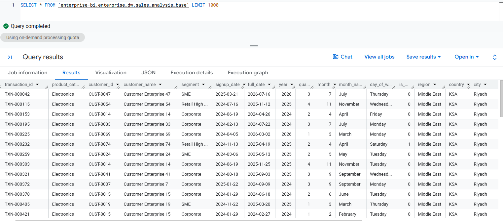
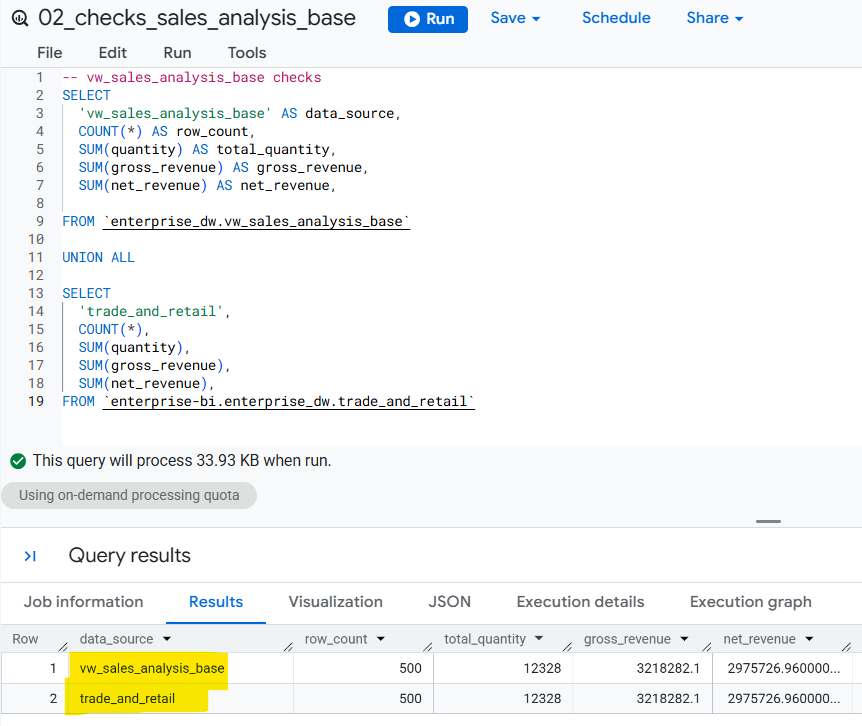

# 🧭 Phase 3: BigQuery SQL Modeling & Data Transformation
## 🔷 Step 2: Build the Base Analytical View

Create the foundational transaction-level analytical view for the Sales & Retail domain using BigQuery SQL.

This view combines the validated sales fact table with the required shared dimensions while preserving the original transaction grain.

## Analytical View

**View:** `vw_sales_analysis`

**Grain:** One row = one sales transaction

```text id="bq9bqk"
trade_and_retail
       │
       ├── dim_dates
       ├── dim_customers
       └── dim_locations
              ↓
      vw_sales_analysis
```

The view enriches the sales transactions with:

### Transaction & Sales

* `transaction_id`
* `product_category`
* `quantity`
* `unit_price`
* `discount_amount`
* `gross_revenue`
* `net_revenue`

### Date Attributes

* `full_date`
* `year`
* `quarter`
* `month`
* `month_name`
* `day_of_week`
* `is_weekend`

### Customer Attributes

* `customer_id`
* `customer_name`
* `segment`
* `signup_date`

### Location Attributes

* `location_id`
* `city`
* `country`
* `region`

The transformation intentionally remains simple. More advanced analytical logic will be implemented in the dashboard-ready views developed in Step 3.

> ### SQL File: [`02_sql_sales_analysis_base.sql`](../sql/02_sql_sales_analysis_base.sql)
</br>

 </br></br>


## Validation

The completed view will be reconciled against the source warehouse to confirm:

* Source and analytical row counts
* Quantity totals
* Gross revenue totals
* Net revenue totals

The validation focuses on confirming transformation accuracy.

> ### SQL File: [`02_sql_sales_analysis_base.sql`](../sql/02_sql_sales_analysis_base.sql)
</br>




## Outcome

**`vw_sales_analysis_base`** provides the reusable transaction-level foundation for the downstream analysis.

### Next: [[Step 3: Build Dashboard-Ready Analytical Views](03_dashboard_ready_views.md)]
