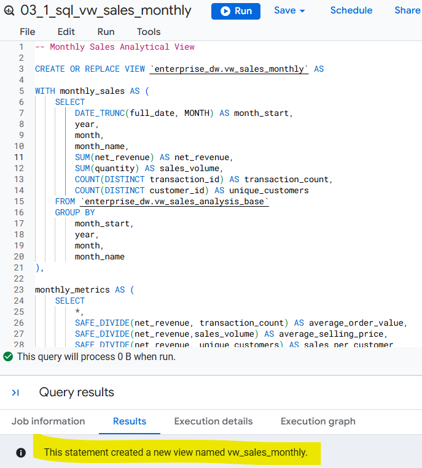
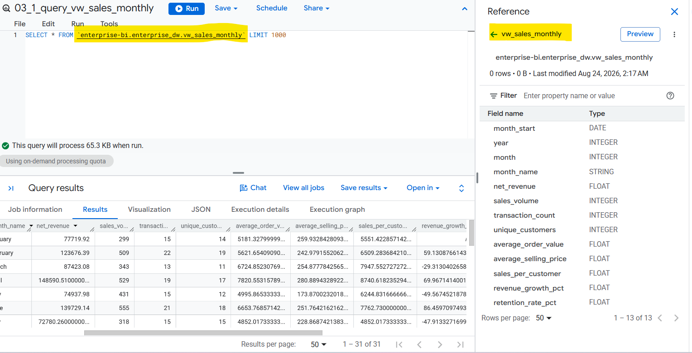
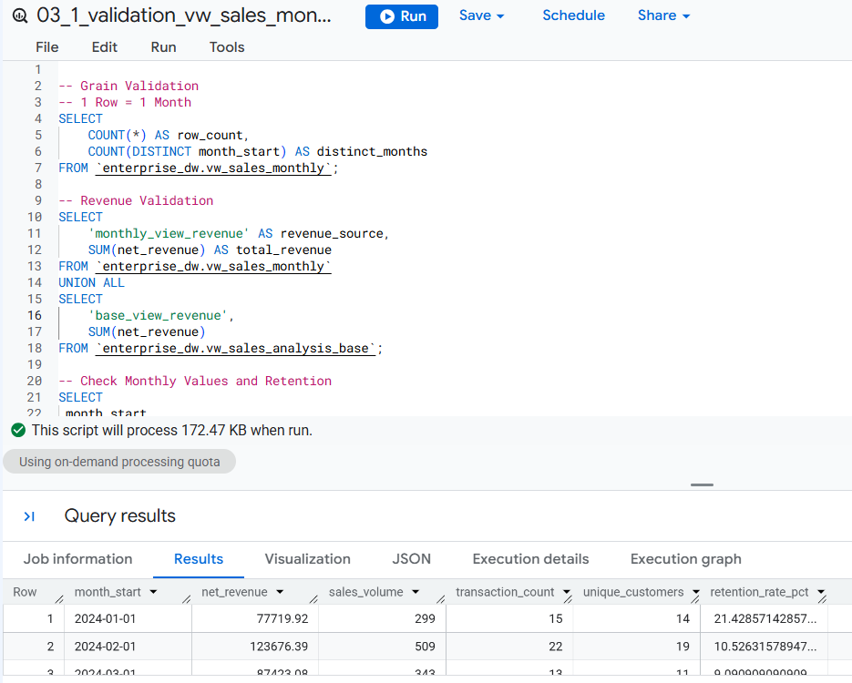

## Step 3.1: Build the Monthly Sales Analytical View (`vw_sales_monthly`)

Create `vw_sales_monthly` as the primary time-based analytical view for the Sales & Retail dashboard. The view aggregates the transaction-level `vw_sales_analysis_base` data to one row per calendar month and provides the core sales KPIs required for time-series analysis.

### Key Metrics

The view provides:

* Net Revenue
* Sales Volume
* Transaction Count
* Unique Customers
* Average Order Value (AOV)
* Average Selling Price
* Sales per Customer
* Month-over-Month Revenue Growth
* Customer Retention Rate

### Design Approach

The view is built from `vw_sales_analysis_base` which was created in Step 2, rather than directly from the warehouse tables.

```text
Warehouse → vw_sales_analysis_base → vw_sales_monthly → Looker Studio
```
</br>



</br>
</br>




### Validation

The view is validated against `vw_sales_analysis_base` to confirm:

* One row per month
* Revenue reconciliation
* Sales volume reconciliation
* Transaction consistency
* Customer counts




### Deliverables

>  ### SQL File: [`03_1_sql_vw_sales_monthly.sql`](../sql/03_1_sql_vw_sales_monthly.sql)
>  ### SQL File: [`03_1_validation_vw_sales_monthly.sql`](../sql/03_1_validation_vw_sales_monthly.sql)
