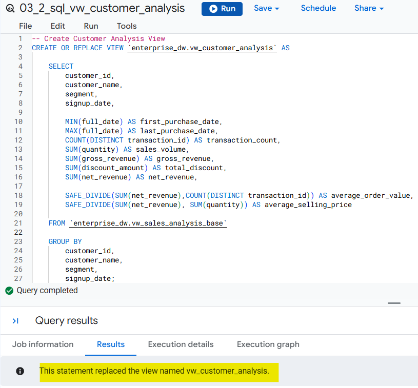
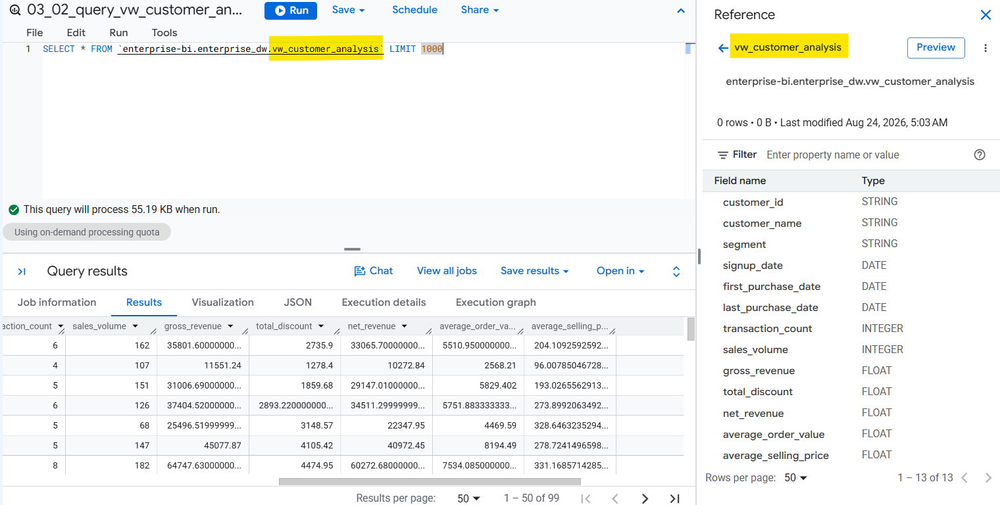
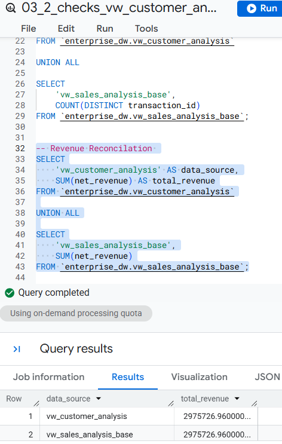

# 🧭 Phase 3: BigQuery SQL Modeling & Data Transformation
## 🔷 Step 3: Build Dashboard-Ready Analytical Views </br></br> 🔷🔷 Step 3.2: Build the Customer Analysis View `vw_customer_analysis`

Create `vw_customer_analysis` as the customer-level analytical view for the Sales & Retail domain. This view aggregates the transaction-level `vw_sales_analysis` data to support customer performance and segment analysis.

## Key Metrics

The view provides:

* First Purchase Date
* Last Purchase Date
* Transaction Count
* Sales Volume
* Gross Revenue
* Total Discount
* Net Revenue
* Average Order Value
* Average Selling Price
* Customer Attributes

### Design Approach

The view is built from `vw_sales_analysis_base` which was created in Step 2, rather than directly from the warehouse tables.

```text
Warehouse → vw_sales_analysis_base → vw_sales_monthly → Looker Studio
```
>  ### SQL File: [`03_2_sql_vw_customer_analysis.sql`](../sql/03_2_sql_vw_customer_analysis.sql)

</br>



</br>
</br>



## Validation

The view will be validated to confirm:

* One row per customer
* Customer-level revenue reconciliation
* Transaction reconciliation
* Sales volume reconciliation
* Correct first and last purchase dates
* Correct customer-level calculations

> ### SQL File: [`03_2_checks_vw_customer_analysis.sql`](../sql/03_2_checks_vw_customer_analysis.sql)
</br>



### Next: [[Step 3.3: Build the Location Analysis View](03_3_vw_location_analysis.md)]