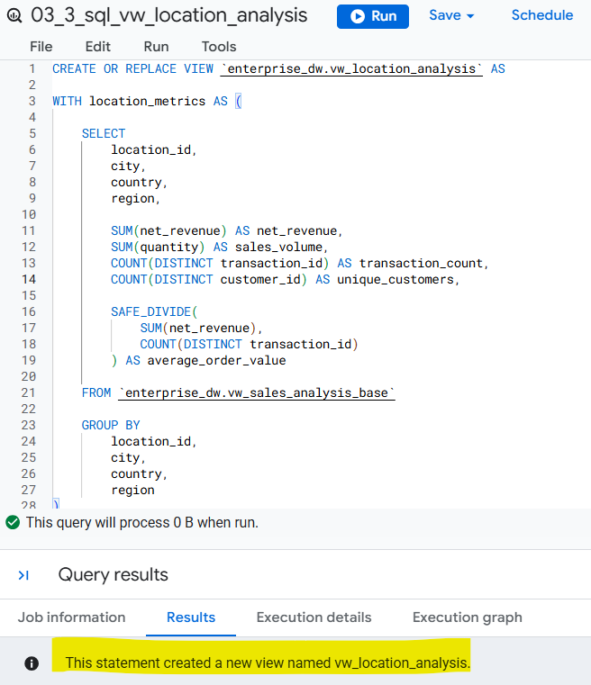
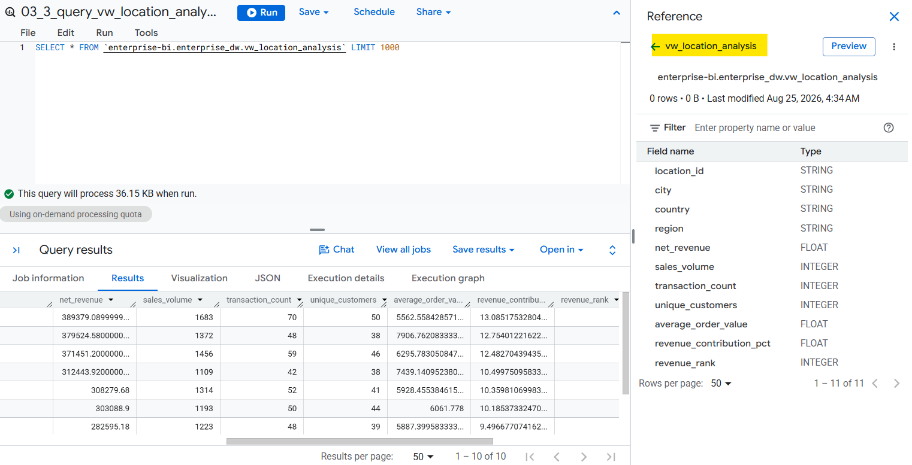
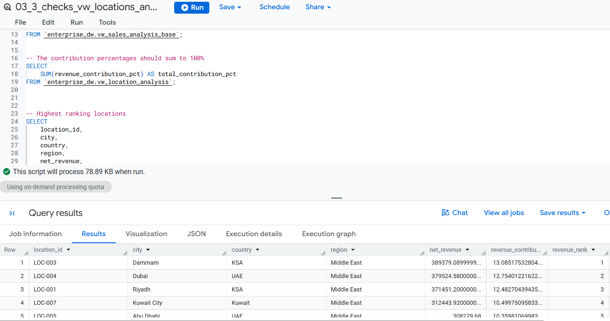

# 🧭 Phase 3: BigQuery SQL Modeling & Data Transformation
## 🔷 Step 3: Build Dashboard-Ready Analytical Views </br></br> 🔷🔷 Step 3.3: Build the Location Analysis View `vw_location_analysis`

Create `vw_location_analysis` as the location-level analytical view for the Sales & Retail domain. This view aggregates the transaction-level `vw_sales_analysis` data to support geographic performance analysis in Looker Studio.

## Key Metrics

The view provides:

* Net Revenue
* Sales Volume
* Transaction Count
* Unique Customers
* Average Order Value
* Revenue Contribution %
* Revenue Rank
* Location Attributes


### Design Approach

The view is built from `vw_sales_analysis_base` which was created in Step 2, rather than directly from the warehouse tables.

```text
Warehouse → vw_sales_analysis_base → vw_sales_monthly → Looker Studio
```
>  ### SQL File: [`03_3_sql_vw_location_analysis.sql`](../sql/03_2_sql_vw_customer_analysis.sql)

</br>



</br></br>




## Validation

The view will be validated to confirm:

* One row per location
* Revenue reconciliation
* Sales volume reconciliation
* Transaction consistency
* Customer counts
* Revenue contribution totals
* Revenue ranking

Validation results will be documented after the view is executed and reviewed.

> ### SQL File: [`03_2_checks_vw_location_analysis.sql`](../sql/03_3_checks_vw_locations_analysis.sql)
</br>




### Next: [[Phase 4: Looker Studio Dashboard Design](../../phase_4_looker_dashboard/)]